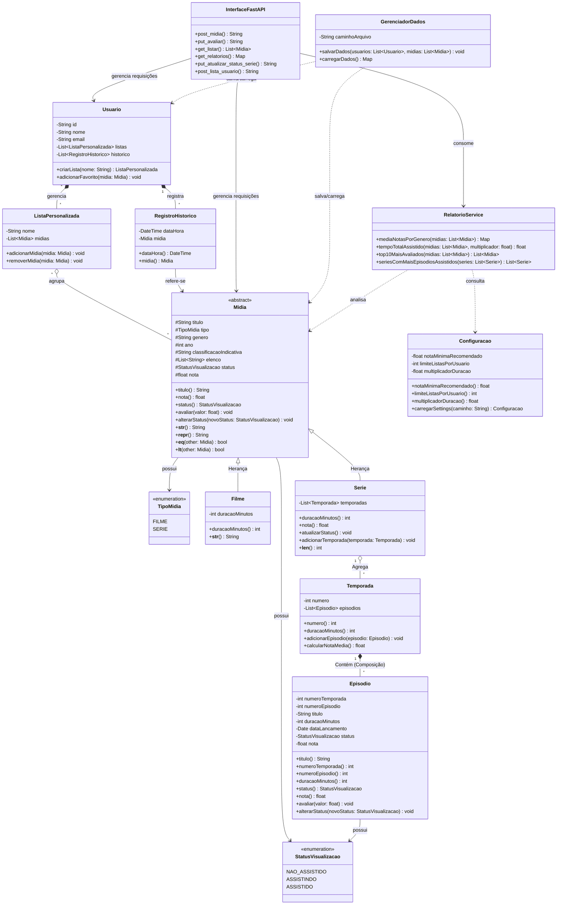

Aqui está uma proposta para o ficheiro `README.md` do seu projeto, redigida em Português de Portugal e estruturada com base nas informações e requisitos fornecidos.

---

# Catálogo de Filmes e Séries

## 📌 Visão Geral

Este projeto consiste numa API desenvolvida em FastAPI (ou sistema de linha de comando CLI) para gerir um catálogo pessoal de filmes e séries. O objetivo do sistema é permitir que o utilizador acompanhe o progresso de visualização de séries, compare avaliações entre mídias, gira listas personalizadas e consulte relatórios de consumo. A modelação do sistema é fortemente orientada a objetos (POO), enfatizando conceitos como herança, encapsulamento, validações e composição.

## 🚀 Funcionalidades Principais

* **Cadastro de Mídias**: Permite o registo de filmes e séries com atributos como título, tipo, género, ano, duração e classificação indicativa. O sistema impede a duplicidade de mídias que possuam o mesmo título, tipo e ano.


* **Gestão de Séries e Episódios**: Suporta o registo de temporadas e episódios para a entidade Série. O sistema marca automaticamente a série com o status de "ASSISTIDA" assim que todos os seus episódios estiverem concluídos.


* **Sistema de Avaliações**: Os utilizadores podem avaliar filmes e episódios atribuindo uma nota numérica de 0 a 10. O sistema calcula de forma automática a nota média das séries e a nota geral do catálogo.


* **Histórico e Listas Personalizadas**: Regista a data e hora de conclusão de cada mídia. Permite criar listas personalizadas (ex: "Para assistir", "Favoritos") até um limite definido nas configurações e adicionar/remover mídias das mesmas.


* **Relatórios e Estatísticas**: Geração de relatórios que incluem a média de notas por género, o tempo total assistido por tipo de mídia, o Top 10 das mídias mais bem avaliadas e as séries com o maior número de episódios assistidos. Os relatórios consideram apenas mídias com o status "ASSISTIDO".


* **Configurações Dinâmicas**: Leitura de parâmetros através do ficheiro `settings.json`, que define a nota mínima para uma mídia ser "recomendada", o limite de listas por utilizador e o multiplicador de duração para conversão de tempo.


## 📂 Estrutura de Arquivos e Diretórios

A arquitetura do projeto está organizada em camadas, separando a interface, as regras de negócio e os modelos de domínio:

```text
catalogo_filmes/
│
├── main.py                  # Ponto de entrada da aplicação FastAPI
├── dados.py                 # Módulo exigido para persistência (GerenciadorDados)
├── settings.json            # Ficheiro de configurações exigido no projeto
├── README.md                # O seu ficheiro com a explicação, objetivo e Mermaid
├── requirements.txt         # Lista de dependências (fastapi, uvicorn, pytest)
│
├── api/                     # Camada de Interface (Rotas FastAPI)
│   ├── __init__.py
│   └── rotas.py             # Representa a classe InterfaceFastAPI
│
├── models/                  # Camada de Domínio (Classes principais)
│   ├── __init__.py
│   ├── enums.py             # StatusVisualizacao e TipoMidia
│   ├── midia.py             # Midia, Filme, Serie, Temporada, Episodio
│   └── usuario.py           # Usuario, ListaPersonalizada, RegistroHistorico
│
├── services/                # Camada de Regras de Negócio
│   ├── __init__.py
│   ├── relatorio.py         # RelatorioService (Cálculos de médias e top 10)
│   └── configuracao.py      # Classe Configuracao (Lê o settings.json)
│
└── tests/                   # Diretório para os testes automatizados
    ├── __init__.py
    ├── test_midia.py        # Testes das regras de negócio de Mídias/Episódios
    └── test_relatorios.py   # Testes dos cálculos matemáticos

```

## 📊 Diagrama de Classes (UML)

Abaixo encontra-se a representação da modelação orientada a objetos do projeto, ilustrando os relacionamentos de herança, composição e agregação:




